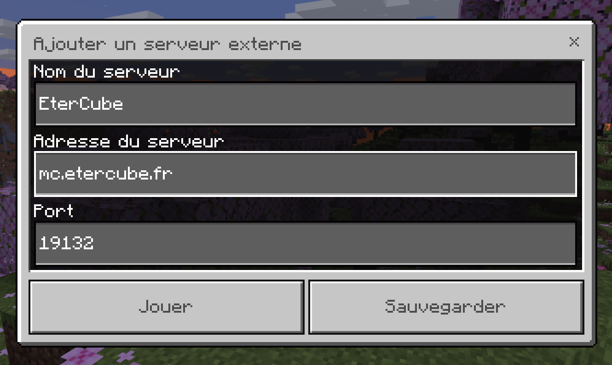

---
layout:
  title:
    visible: true
  description:
    visible: false
  tableOfContents:
    visible: true
  outline:
    visible: true
  pagination:
    visible: true
---

# 🖐 Se Connecter

## Bienvenue sur <mark style="color:blue;">EterCube</mark> !

Sur cette page, nous allons vous expliquer comment rejoindre notre serveur Minecraft.


#### <mark style="color:blue;">**A savoir avant de commencer**</mark>

* <mark style="color:orange;">**Asurez-vous d'avoir Minecraft installé sur votre appareil**</mark>
* Le serveur prend en charge les versions Java (Premium et Crack) mais aussi la version Bedrock
* Nous vous recommandons de vous connecter en 1.19.4 (même si les versions antérieures sont plus ou moins prises en charges)


Ensuite, cliquez sur l'édition de votre jeu et suivez les différentes étapes :



1. Ouvrez votre launcher Minecraft
2. Si vous avez déjà une configuration pour la version 1.19.4, lancez-la directement et reporter vous au point numéro 6. Sinon, nous allons vous guider pour la créer
3. Dans l'onglet "Configurations" du launcher, cliquez sur "Nouvelle configuration" au-dessus de vos configurations existantes
4. Donnez un nom à votre instance, sélectionnez la version "Release 1.19.4"
5. Créez et lancez cette nouvelle configuration pour télécharger et initialiser les données nécessaires au fonctionnement du jeu
6. Une fois dans le jeu, ajustez vos paramètres selon vos préférences, puis allez dans le menu principal et sélectionnez "Multijoueur"
7. Cliquez sur "Ajouter un serveur" et entrez le nom "EterCube" dans la première ligne, puis l'IP du serveur "mc.etercube.fr" dans la seconde
8. Quand vous serez connecté, n'oubliez pas d'activer le pack de ressource, qui est nécessaire



Il existe de nombreux launchers disponibles en ligne pour obtenir le jeux gratuitement.

Nous vous recommandons de rechercher un tutoriel adapté à votre launcher pour obtenir des instructions détaillées mais nous ne pouvons pas vous aider pour des raisons légales.

Une fois dans le jeu !

1. Ajustez vos paramètres selon vos préférences, puis allez dans le menu principal et sélectionnez "Multijoueur"
2. Cliquez sur "Ajouter un serveur" et entrez le nom "EterCube" dans la première ligne, puis l'IP du serveur "mc.etercube.fr" dans la seconde
3. Maintenant que vous êtes connecté, utilisez la commande `/register MOT_DE_PASSE`, en remplaçant `MOT_DE_PASSE` par le mot de passe de votre choix. Lors de chaque connexion, vous devrez exécuter la commande `/login MOT_DE_PASSE` pour accéder au serveur
4. Quand vous serez connecté, n'oubliez pas d'activer le pack de ressource, qui est nécessaire



1. Lancez votre Minecraft
2. Cliquez sur "Jouer", puis sur "Serveur" en haut à droite de la fenêtre qui apparaît
3. Faites défiler vers le bas la liste des serveurs à gauche jusqu'à trouver le bouton "Ajouter un serveur", et cliquez dessus
4. Dans l'interface qui apparaît, entrez le nom "EterCube" dans la première zone de texte
5.  Entrez l'IP "mc.etercube.fr" dans la zone "Adresse", puis "19132" dans la zone "Port"

    <figure><figcaption></figcaption></figure>
6. Enregistrez les modifications, puis défilez vers le bas dans la liste des serveurs
7. Quand vous serez connecté, n'oubliez pas d'activer le pack de ressource, qui est nécessaire



